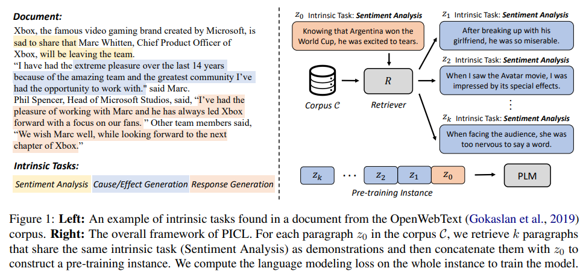

# Pre-Training to Learn in Context

This repository contains the code of our ACL2023 paper:

> [Pre-Training to Learn in Context](https://arxiv.org/pdf/2305.09137.pdf)

In this work, we propose PICL (**P**re-training for **I**n-**C**ontext **L**earning), a framework to enhance the language models' in-context learning ability by pre-training the model on a large collection of ``intrinsic tasks'' in the general plain-text corpus using the simple language modeling objective. PICL encourages the model to infer and perform tasks by conditioning on the contexts while maintaining task generalization of pre-trained models. 



## 1 Install
```bash
# setup environment with conda
conda create -n picl python=3.8
# install basic packages
pip3 install -r requirements.txt
conda install faiss-gpu -c pytorch
# install transformers & promptsource
pip3 install -e transformers
pip3 install -e promptsource
```

## 2 Prepare Corpus
Download [OpenWebText](https://huggingface.co/datasets/openwebtext), [Wikicorpus](https://huggingface.co/datasets/wikicorpus), and [Bookcorpus](https://huggingface.co/datasets/bookcorpus). Run `tools/prepare_raw_data.py` to get all full_documents and merge them:
```bash
python3 tools/prepare_raw_data.py /PATH/TO/openwebtext pretrain_data/raw/openwebtext.txt
python3 tools/prepare_raw_data.py /PATH/TO/wikicorpus pretrain_data/raw/wikicorpus.txt
python3 tools/prepare_raw_data.py /PATH/TO/bookcorpus pretrain_data/raw/bookcorpus.txt
cat pretrain_data/raw/openwebtext.txt pretrain_data/raw/wikicorpus.txt pretrain_data/raw/bookcorpus.txt > pretrain_data/raw/merge_no_shuf.txt
shuf -o pretrain_data/raw/merge_no_shuf.txt pretrain_data/raw/merge.txt
```
The "\n" tokens in full documents are replace by a special token "<@x(x!>" such that each document occupy a single line in the file.

## 3 Run
Run the entire pipeline in a toy setting (corpus size = 100K) with
```
bash pipeline.sh
```
Step-by-step runing. `${BASE_PATH}` is the path of the directory of this project:
### 3.1 Corpus Processing
+ Split full documents into paragraphs.
    ```bash
    bash scripts/tools/process_corpus.sh
    ```
+ Process full document data. The scripts will generate `.bin` and `.idx` files.
    ```bash
    bash scripts/tools/process_full_doc_data_gpt2.sh ${BASE_PATH}
    ```
+ Tokenize paragraphs in corpus. The scripts will generate `.bin` and `.idx` files.
    ```bash
    bash scripts/tools/process_picl_data_gpt2.sh ${BASE_PATH}
    ```

#### NOTE
Since the corpus is large, the `.bin` file of full document data will be about 29G and the paragraph data will be about 13G. The data processing may take long, and there may be unexpected problems that stuck the process (like running out of CPU memories). To handle this issue, you can split the `merge.txt` file to multiple files like:
```bash
split -C 1000M merge.txt
```
And then, you can process the split files one by one (by setting different `picl-data-name` and `bin-file-index` in `process_full_doc_data_gpt2.sh`), each takes less time and has less risk of running into problems. Assume that you have generated two (`.bin`, `.idx`) pairs:
```
train_lm_1.bin
train_lm_1.idx
train_lm_2.bin
train_lm_2.idx
```
You can finally merge them by runing
```bash
bash scripts/tools/merge_bin_files.sh ${BASE_PATH}
```
which will merge the two pairs into `train_lm_0.bin` and `train_lm_0.idx`.

We are still working on releasing the processed data to HuggingFace.

### 3.2 Retrival
+ Process training data for retriever. Construct hard negatives. The preprocessed data can be downloaded from this [link](https://drive.google.com/file/d/1MMNLT44Qqktxn_-rgVbPVtn8ewFYVGDr/view?usp=share_link).
    ```bash
    python3 tools/process_retriever_train_data.py --save retriever_data --data-names TRAIN
    ```
+ Train the retriever. The `train.jsonl` and `valid.jsonl` data should be put in `retriever_data/TRAIN/p1_en1_hn1_s42/merge`. The trained retriever can be downloaded from this [link](https://drive.google.com/drive/folders/1A7gW9tNJK9QIg0y_Kvsod0i8wgvhPKq8?usp=share_link)
    ```bash
    bash scripts/retriever/train.sh ${BASE_PATH}
    ```
+ Get encoded paragraphs.
    ```bash
    bash scripts/retriever/infer.sh ${BASE_PATH}
    ```
+ Search for paragraphs that share the same intrinsic tasks.
    ```bash
    bash scripts/retriever/search.sh ${BASE_PATH}
    ```

### 3.3 Filter
+ Filter out non-informative samples.
    ```bash
    bash scripts/filter/filter.sh ${BASE_PATH}
    ```

### 3.4 Pre-train
+ Pre-train the LM with PICL. The pre-trained models can be downloaded from this [link](https://drive.google.com/drive/folders/1RVl560T1KyKCVnHb42RX5xbC9hPPb6VS?usp=share_link).
    ```bash
    bash scripts/pretrain/pretrain_picl_gpt2_large.sh ${BASE_PATH}
    ```

### 3.5 Evaluation
+ Evaluate the trained model on text classification datasets and super-natural instructions. The evaluation data can be downloaded from this [link](https://drive.google.com/drive/folders/18R0l7SF8DfqwZzIcaqqfKx0wSEZ5-T5t?usp=share_link).
    ```bash
    bash scripts/eval/eval_cls.sh ${BASE_PATH}
    bash scripts/eval/eval_inst.sh ${BASE_PATH}
    ```

## 4 Citation
```
@inproceedings{gu2023picl,
  title={Pre-Training to Learn in Context},
  author={Gu, Yuxian and Dong, Li and Wei, Furu and Huang, Minlie},
  booktitle={Proceedings of ACL},
  year={2023}
}
```
